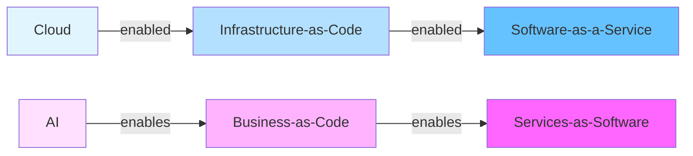

# Business-as-Code & Services-as-Software Research

**Date:** 2025-10-02
**Purpose:** Research and design elegant TypeScript interfaces for expressing entire businesses as code

## Key Insights

### The Paradigm Shift



**Historical Pattern:**
- **Cloud** unlocked Infrastructure-as-Code → enabled Software-as-a-Service boom
- **AI** unlocks Business-as-Code → enables Services-as-Software revolution

### GDPval + ONET Connection

**ONET (Occupational Information Network)**
- Database of ~1,000 occupations sponsored by U.S. Dept of Labor
- Contains: Tasks, Skills, Knowledge, Abilities, Tools, Technologies
- Classifies work as "knowledge work" vs "physical/manual labor"
- Basis for understanding what work humans do

**GDPval (OpenAI Evaluation Framework)**
- Measures AI performance on **economically valuable, real-world tasks**
- 44 occupations from top 9 GDP-contributing industries
- 1,320 specialized tasks (220 open-sourced)
- Evaluates if AI can do the work humans are paid to do
- Direct connection: ONET tasks → GDPval evaluation → GDP value

**Platform Integration:**
```
ONET Data → Database (things/relationships)
    ↓
GDPval Tasks → AI Capability Evaluation
    ↓
Service Pricing → Based on GDP contribution
    ↓
Business Definition → Composition of services
```

### Business-as-Code Vision

**What is it?**
Express an entire business (purpose, goals, org structure, processes, workflows) as executable TypeScript code that AI can understand, plan, and execute.

**Why now?**
- AI agents becoming superhuman at **knowledge work** (everything in ONET that's non-physical)
- Organizational inertia prevents existing businesses from fully leveraging AI
- AI-native businesses easier to build from scratch than retrofit legacy orgs
- Services that previously required humans can now be delivered by AI agents

**Key Capabilities:**
1. **Imagine** - AI designs business model, value proposition, go-to-market
2. **Build** - AI generates infrastructure, processes, systems
3. **Launch** - AI deploys, configures, integrates, tests
4. **Grow** - AI acquires customers, runs experiments, optimizes funnels
5. **Scale** - AI handles increased load, adds capacity, maintains quality
6. **Manage** - AI monitors KPIs, allocates resources, makes decisions
7. **Operate** - AI executes daily tasks, handles exceptions, learns

## Business Types & AI Capabilities

### Entirely AI-Run Businesses

**Characteristics:**
- 100% knowledge work (no physical labor)
- Standardized deliverables (code, content, analysis, advice)
- Clear quality metrics (automated testing possible)
- Asynchronous delivery (no real-time human interaction required)
- Digital distribution (no physical logistics)

**Examples:**
1. **Software Development Services**
   - Code generation, testing, documentation
   - Repository management, CI/CD
   - All ONET tasks for Software Developers (15-1252.00)

2. **Content Marketing Services**
   - Blog posts, social media, email campaigns
   - SEO optimization, content strategy
   - All ONET tasks for Marketing Managers (11-2021.00)

3. **Data Analysis Services**
   - Report generation, dashboard creation
   - Statistical analysis, data visualization
   - All ONET tasks for Data Scientists (15-2051.01)

4. **Accounting/Bookkeeping Services**
   - Transaction recording, reconciliation
   - Financial statement generation, tax prep
   - All ONET tasks for Accountants (13-2011.00)

5. **Legal Document Services**
   - Contract drafting, review, analysis
   - Legal research, compliance checking
   - All ONET tasks for Paralegals (23-2011.00)

### Human-Supervised Businesses

**Characteristics:**
- Mix of knowledge work (AI) + judgment calls (human)
- Creative deliverables requiring human approval
- Customer interaction benefits from human touch
- Quality assured by human review
- Strategic decisions by humans, execution by AI

**Examples:**
1. **Design Services** (80% AI, 20% human)
   - AI generates designs, human approves/refines
   - Human handles client communication
   - AI executes approved designs

2. **Consulting Services** (60% AI, 40% human)
   - AI conducts research, analysis, drafting
   - Human provides insights, recommendations
   - Human manages client relationships

3. **Customer Support** (70% AI, 30% human)
   - AI handles tier 1 support, FAQs
   - Human escalation for complex issues
   - AI learns from human resolutions

### Management Structures

#### 1. AI Managing Humans
**When:** High-volume standardized tasks with measurable outputs
- AI assigns work based on skills/availability
- AI monitors quality, productivity metrics
- AI optimizes schedules, workload distribution
- Humans execute, AI coordinates

**Example:** Content writing service
- AI generates briefs, assigns to writers
- AI tracks progress, sends reminders
- AI reviews submissions for quality
- Humans write, AI manages process

#### 2. Humans Managing AI
**When:** Complex deliverables requiring expert judgment
- Human defines strategy, objectives
- Human reviews AI outputs, provides feedback
- Human makes final decisions
- AI executes, human supervises

**Example:** Strategic consulting
- Human consultant defines scope
- AI conducts research, analysis
- Human reviews findings, crafts recommendations
- AI generates deliverables, human approves

#### 3. Hybrid (Both)
**When:** Large-scale operations with multiple specializations
- AI manages routine operations
- Humans manage AI for complex work
- AI coordinates between human managers
- Recursive management hierarchy

**Example:** Full-service agency
- AI manages routine tasks (scheduling, reporting)
- Humans manage creative AI (design, copywriting)
- AI coordinates across departments
- Humans set overall strategy

## Communication & Collaboration

### AI-AI Communication
**Protocols:**
- **RPC (Workers RPC)** - Type-safe, low-latency, sub-1ms
- **MCP (Model Context Protocol)** - Tool use, context sharing
- **REST APIs** - HTTP/JSON for external integrations
- **Queue Messages** - Asynchronous work distribution
- **WebSockets** - Real-time bidirectional communication

**Patterns:**
```typescript
// Direct RPC call
const result = await agentsService.executeAgent(id, input)

// MCP tool use
const tools = await mcpServer.listTools()
const result = await mcpServer.callTool('analyze_document', { url })

// Queue message
await queue.send({ type: 'process_order', orderId })

// Event-driven
business.on('order.created', async (order) => {
  await fulfillmentAgent.process(order)
})
```

### AI-Human Communication
**Channels:**
- **Email** - Formal updates, notifications, requests
- **Slack/Discord** - Real-time collaboration, quick questions
- **Dashboard** - Visual KPIs, reports, charts
- **Voice** - VAPI for calls, meetings, voice commands
- **Forms** - Structured input collection

**Patterns:**
```typescript
// Notify human for approval
await slack.send({
  channel: '#approvals',
  text: 'New design ready for review',
  attachments: [{ url: designUrl }]
})

// Request human input
const decision = await form.request({
  type: 'approval',
  question: 'Approve this purchase?',
  options: ['approve', 'reject', 'modify']
})

// Voice call for complex issues
if (complexity > threshold) {
  await vapi.call({
    to: humanExpert,
    context: issueDetails,
    goal: 'resolve technical issue'
  })
}
```

### Human-Human Communication (AI-Facilitated)
**AI Roles:**
- **Coordinator** - Schedule meetings, distribute agendas
- **Summarizer** - Capture notes, action items
- **Translator** - Cross-team/language communication
- **Mediator** - Conflict resolution suggestions

**Patterns:**
```typescript
// AI schedules and prepares meeting
const meeting = await coordinator.schedule({
  participants: [ceo, cto, cmo],
  topic: 'Q4 Planning',
  duration: '1 hour',
  prepare: {
    agenda: true,
    prework: ['Q3 results', 'market analysis'],
    materials: ['slides', 'spreadsheet']
  }
})

// AI captures and distributes notes
meeting.on('end', async (recording) => {
  const summary = await ai.summarize(recording)
  const actionItems = await ai.extractTasks(recording)

  await slack.send({
    channel: '#leadership',
    summary,
    actionItems
  })
})
```

## OKRs at Every Level

### Hierarchy Design

```
Holding Company
├── Objective: Maximize shareholder value
│   └── KRs: Revenue growth, profit margin, market share
│
├── Business Unit 1
│   ├── Objective: Dominate vertical X
│   │   └── KRs: Market share, NPS, CAC:LTV
│   │
│   ├── Department (Sales)
│   │   ├── Objective: Hit revenue target
│   │   │   └── KRs: Pipeline, close rate, ACV
│   │   │
│   │   ├── Team (SDRs)
│   │   │   └── OKR: Generate qualified leads
│   │   │
│   │   └── IC (SDR Agent)
│   │       └── OKR: 50 qualified calls/day
│   │
│   └── Department (Product)
│       └── ...
│
└── Business Unit 2
    └── ...
```

### TypeScript Expression

```typescript
type OKR = {
  objective: string
  keyResults: KeyResult[]
  owner: Agent | Human | Team
  timeframe: 'quarter' | 'year' | 'month'
  parent?: OKR
  children?: OKR[]
}

type KeyResult = {
  metric: string
  current: number
  target: number
  unit: string
  progress: number // 0-100%
}

// Holding company level
const holdingCo: OKR = {
  objective: 'Build portfolio of $100M+ ARR businesses',
  keyResults: [
    { metric: 'Total ARR', current: 25_000_000, target: 100_000_000, unit: '$', progress: 25 },
    { metric: 'Number of businesses', current: 3, target: 10, unit: 'businesses', progress: 30 },
    { metric: 'Avg profit margin', current: 0.15, target: 0.40, unit: '%', progress: 37.5 }
  ],
  owner: ceo,
  timeframe: 'year',
  children: [businessUnit1, businessUnit2, ...]
}

// Business unit level
const businessUnit1: OKR = {
  objective: 'Dominate AI-powered content services market',
  keyResults: [
    { metric: 'Market share', current: 0.05, target: 0.25, unit: '%', progress: 20 },
    { metric: 'ARR', current: 5_000_000, target: 25_000_000, unit: '$', progress: 20 },
    { metric: 'NPS', current: 45, target: 75, unit: 'score', progress: 60 }
  ],
  owner: businessUnit1CEO,
  timeframe: 'year',
  parent: holdingCo,
  children: [salesOKR, productOKR, marketingOKR]
}

// Department level
const salesOKR: OKR = {
  objective: 'Build predictable $25M revenue engine',
  keyResults: [
    { metric: 'Pipeline', current: 15_000_000, target: 75_000_000, unit: '$', progress: 20 },
    { metric: 'Close rate', current: 0.15, target: 0.30, unit: '%', progress: 50 },
    { metric: 'ACV', current: 50_000, target: 100_000, unit: '$', progress: 50 }
  ],
  owner: cro,
  timeframe: 'quarter',
  parent: businessUnit1,
  children: [sdrTeamOKR, aeTeamOKR]
}

// Team level
const sdrTeamOKR: OKR = {
  objective: 'Generate $30M qualified pipeline',
  keyResults: [
    { metric: 'SQLs', current: 100, target: 500, unit: 'leads', progress: 20 },
    { metric: 'Qualification rate', current: 0.20, target: 0.40, unit: '%', progress: 50 },
    { metric: 'Response rate', current: 0.10, target: 0.25, unit: '%', progress: 40 }
  ],
  owner: sdrManager,
  timeframe: 'quarter',
  parent: salesOKR,
  children: [sdrAgent1OKR, sdrAgent2OKR]
}

// IC level (AI Agent)
const sdrAgent1OKR: OKR = {
  objective: 'Consistently generate high-quality leads',
  keyResults: [
    { metric: 'Outbound calls', current: 200, target: 1000, unit: 'calls', progress: 20 },
    { metric: 'Connect rate', current: 0.15, target: 0.30, unit: '%', progress: 50 },
    { metric: 'SQLs created', current: 10, target: 50, unit: 'leads', progress: 20 }
  ],
  owner: sdrAgent1,
  timeframe: 'month',
  parent: sdrTeamOKR
}
```

### OKR Rollup & Alignment

```typescript
// Calculate progress rollup
function calculateProgress(okr: OKR): number {
  // If leaf node, use key results
  if (!okr.children?.length) {
    return okr.keyResults.reduce((sum, kr) => sum + kr.progress, 0) / okr.keyResults.length
  }

  // If parent, aggregate children
  const childProgress = okr.children.reduce((sum, child) => sum + calculateProgress(child), 0)
  return childProgress / okr.children.length
}

// Check alignment
function checkAlignment(okr: OKR): boolean {
  if (!okr.parent) return true // Top level always aligned

  // Check if objectives support parent
  const supportsParent = okr.parent.keyResults.some(pkr =>
    okr.keyResults.some(kr => kr.metric.includes(pkr.metric))
  )

  return supportsParent && checkAlignment(okr.parent)
}

// Auto-adjust targets
async function autoAdjustTargets(okr: OKR) {
  const progress = calculateProgress(okr)
  const timeElapsed = getTimeElapsed(okr.timeframe)
  const expectedProgress = (timeElapsed / getTotalTime(okr.timeframe)) * 100

  if (progress < expectedProgress * 0.7) {
    // Behind - AI suggests interventions
    const plan = await ai.generateRecoveryPlan(okr)
    await notify(okr.owner, { type: 'behind', plan })
  }

  if (progress > expectedProgress * 1.3) {
    // Ahead - AI suggests raising targets
    const newTargets = await ai.suggestNewTargets(okr, progress)
    await notify(okr.owner, { type: 'ahead', suggestions: newTargets })
  }
}
```

## APIs & SDKs

### Core API Design

**Business Management API**
```typescript
// POST /businesses
createBusiness(definition: BusinessDefinition): Promise<Business>

// GET /businesses/:id
getBusiness(id: string): Promise<Business>

// PUT /businesses/:id/okrs
updateOKRs(id: string, okrs: OKR[]): Promise<Business>

// POST /businesses/:id/deploy
deployBusiness(id: string): Promise<Deployment>

// GET /businesses/:id/metrics
getMetrics(id: string, timeframe: Timeframe): Promise<Metrics>
```

**Agent Management API**
```typescript
// POST /agents
createAgent(config: AgentConfig): Promise<Agent>

// POST /agents/:id/assign
assignTask(id: string, task: Task): Promise<Assignment>

// GET /agents/:id/performance
getPerformance(id: string): Promise<PerformanceMetrics>

// PUT /agents/:id/okr
updateAgentOKR(id: string, okr: OKR): Promise<Agent>
```

**Service Delivery API**
```typescript
// POST /services
defineService(spec: ServiceSpec): Promise<Service>

// POST /services/:id/orders
createOrder(serviceId: string, customer: Customer): Promise<Order>

// GET /orders/:id/status
getOrderStatus(id: string): Promise<OrderStatus>

// POST /orders/:id/deliver
deliverOrder(id: string, deliverable: Deliverable): Promise<void>
```

### TypeScript SDK

```typescript
import { Business, Agent, Service, OKR } from '@do/business-as-code'

// Initialize
const platform = new BusinessPlatform({
  apiKey: process.env.API_KEY
})

// Create business
const business = await platform.business.create({
  name: 'Acme Content Services',
  industry: 'Professional Services',
  services: [
    {
      name: 'Blog Post Writing',
      deliverable: 'blog_post',
      turnaround: '3 days',
      pricing: { model: 'fixed', amount: 500 }
    }
  ],
  okrs: [
    {
      objective: 'Achieve $1M ARR',
      keyResults: [
        { metric: 'MRR', target: 83333, unit: '$' },
        { metric: 'Customers', target: 100, unit: 'count' }
      ]
    }
  ]
})

// Deploy infrastructure
await business.deploy({
  domain: 'acme.io',
  regions: ['us-east', 'eu-west'],
  features: ['payments', 'dashboard', 'api']
})

// Create AI agent
const writer = await business.agents.create({
  role: 'Content Writer',
  capabilities: ['blog_writing', 'seo_optimization'],
  okr: {
    objective: 'Write 10 high-quality posts/week',
    keyResults: [
      { metric: 'Posts written', target: 10, unit: 'posts' },
      { metric: 'Quality score', target: 8.5, unit: 'score' }
    ]
  }
})

// Assign work
business.on('order.created', async (order) => {
  await writer.assign({
    type: 'blog_post',
    brief: order.brief,
    deadline: order.deadline
  })
})

// Monitor performance
business.on('day', async () => {
  const metrics = await business.metrics.daily()
  const progress = await business.okrs.progress()

  if (progress < 70) {
    const plan = await ai.generateActionPlan(business)
    await business.execute(plan)
  }
})
```

## Required Integrations

### Infrastructure & Platform
1. **Cloudflare Workers** - Edge compute, RPC, queues
2. **PostgreSQL/Neon** - Database for entities, relationships
3. **Stripe** - Payments, subscriptions, payouts
4. **WorkOS** - Authentication, SSO, organizations

### AI & ML
5. **OpenAI** - GPT-4, embeddings, batch API
6. **Anthropic** - Claude for complex reasoning
7. **Workers AI** - Edge inference for speed
8. **Deepgram/ElevenLabs** - Voice (VAPI integration)

### Communication
9. **Slack/Discord** - Team communication
10. **Email (Resend/SendGrid)** - Transactional, marketing
11. **VAPI** - Voice agents for calls
12. **Twilio** - SMS, WhatsApp

### Business Operations
13. **Zapier** - No-code integrations
14. **Airtable** - Flexible databases
15. **Notion** - Documentation, wiki
16. **Google Workspace** - Docs, Sheets, Calendar

### Marketing & Sales
17. **HubSpot** - CRM, marketing automation
18. **Google Ads** - Advertising
19. **Analytics** - Mixpanel, PostHog
20. **Social Media APIs** - Twitter, LinkedIn, etc.

### Delivery & Quality
21. **GitHub** - Code repositories, CI/CD
22. **Figma** - Design collaboration
23. **Grammarly** - Writing quality
24. **Copyscape** - Plagiarism detection

## Implementation Roadmap

### Phase 1: Foundation (Weeks 1-4)
- [ ] Core TypeScript types (Business, Agent, Service, OKR)
- [ ] Database schema for businesses, agents, OKRs
- [ ] Basic API endpoints (CRUD operations)
- [ ] Authentication & authorization

### Phase 2: Agent Framework (Weeks 5-8)
- [ ] Agent creation & configuration
- [ ] Task assignment & queue system
- [ ] Agent-to-agent communication (RPC, MCP)
- [ ] Performance monitoring

### Phase 3: Service Delivery (Weeks 9-12)
- [ ] Service definition DSL
- [ ] Order management system
- [ ] Quality assurance workflows
- [ ] Customer communication

### Phase 4: Business Operations (Weeks 13-16)
- [ ] OKR tracking & rollup
- [ ] Automated reporting
- [ ] AI-driven optimization
- [ ] Human escalation workflows

### Phase 5: Scale & Polish (Weeks 17-20)
- [ ] Multi-business management
- [ ] Advanced analytics
- [ ] Integration marketplace
- [ ] Documentation & examples

## Success Metrics

**Platform Health:**
- Number of businesses created
- Agent utilization rate
- Service delivery success rate
- Customer satisfaction (NPS)

**Economic Impact:**
- Total GMV (Gross Merchandise Value)
- Revenue per business
- Cost savings vs traditional staffing
- Time to market reduction

**AI Performance:**
- Task completion rate
- Quality scores (GDPval-style evaluation)
- Human escalation rate
- Learning velocity (improvement over time)

## Open Questions

1. **Pricing Models** - How to price AI-delivered services?
   - Fixed price vs usage-based?
   - Per-output vs per-hour?
   - Tiered quality levels?

2. **Quality Assurance** - How to ensure AI output quality?
   - Automated testing?
   - Human sampling?
   - Customer feedback loops?

3. **Liability** - Who's responsible for AI mistakes?
   - Platform?
   - Business owner?
   - Insurance model?

4. **Ethical Boundaries** - What services should AI NOT deliver?
   - Healthcare diagnosis?
   - Legal representation?
   - Financial advice?

5. **Human Employment** - Impact on workforce?
   - Reskilling programs?
   - Human-AI collaboration models?
   - New job categories?

## Next Steps

1. **Validate Assumptions** - Talk to potential users
2. **Build MVP** - Simple service business (e.g., blog writing)
3. **Test GDPval Integration** - Evaluate AI on real ONET tasks
4. **Iterate** - Learn from real deployments
5. **Scale** - Add more service types, integrations

---

**Research completed by:** Claude (AI Project Manager)
**Date:** 2025-10-02
**Status:** Ready for implementation
