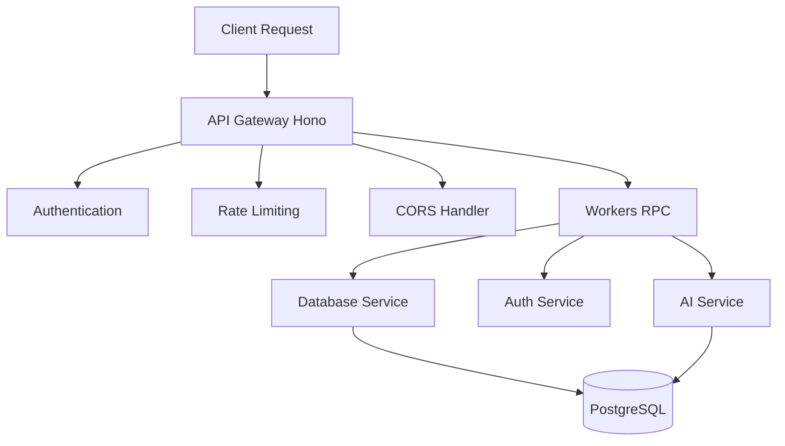
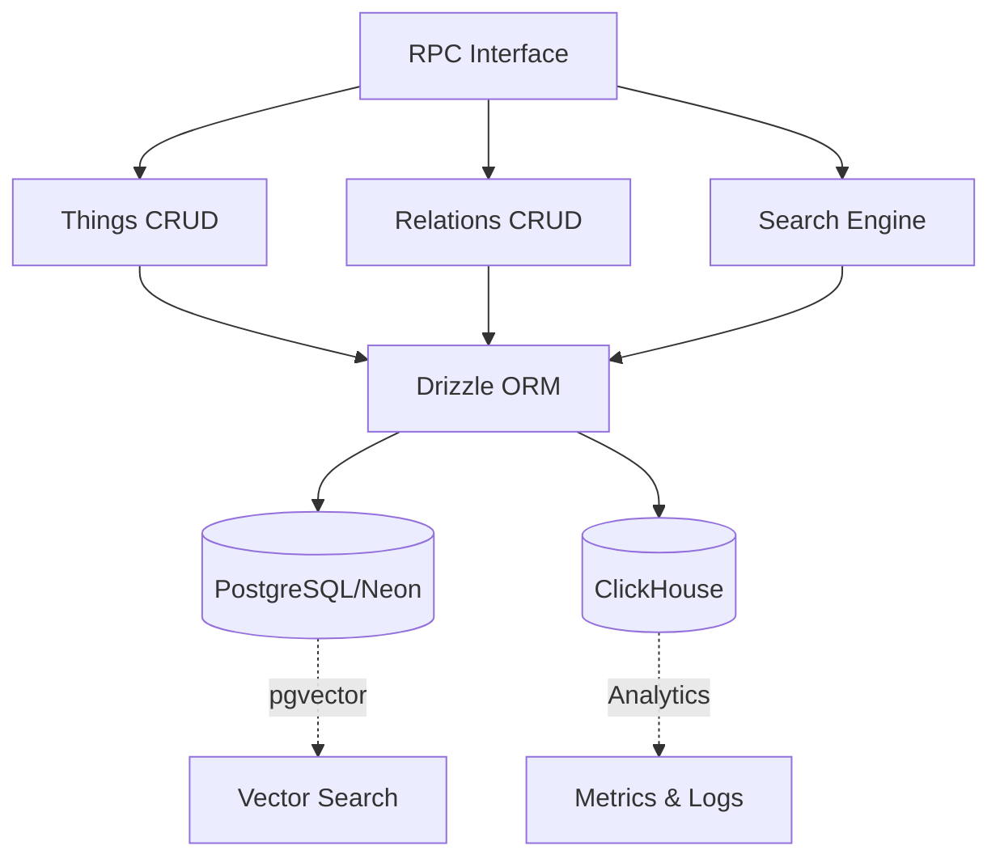
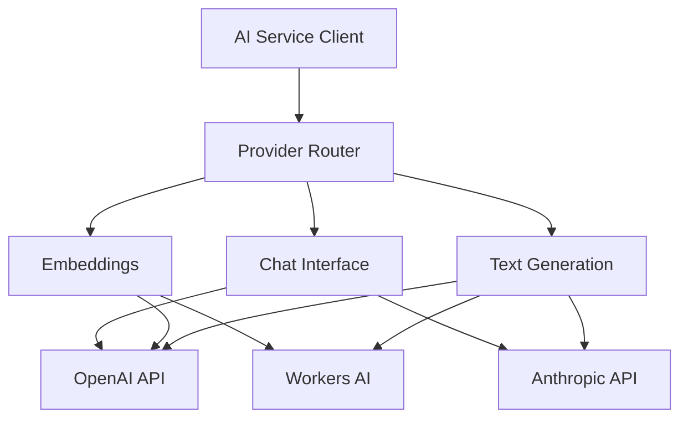
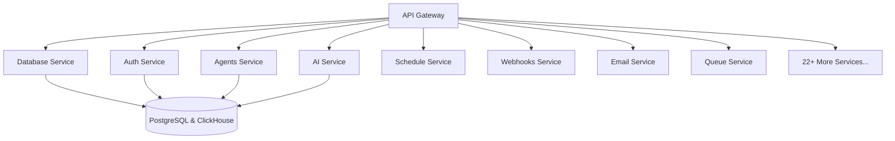
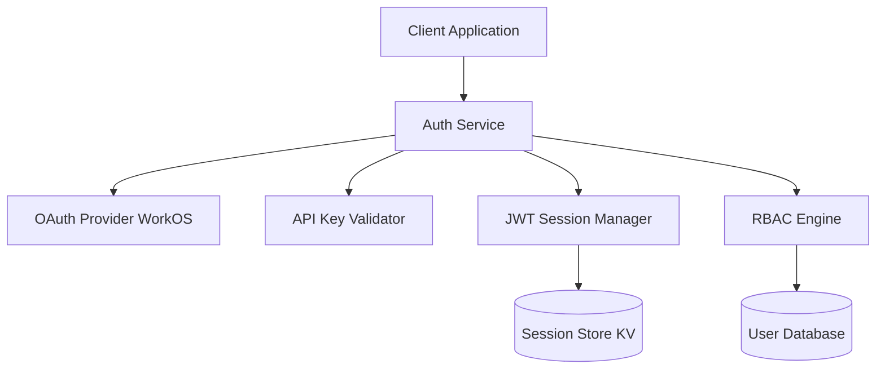
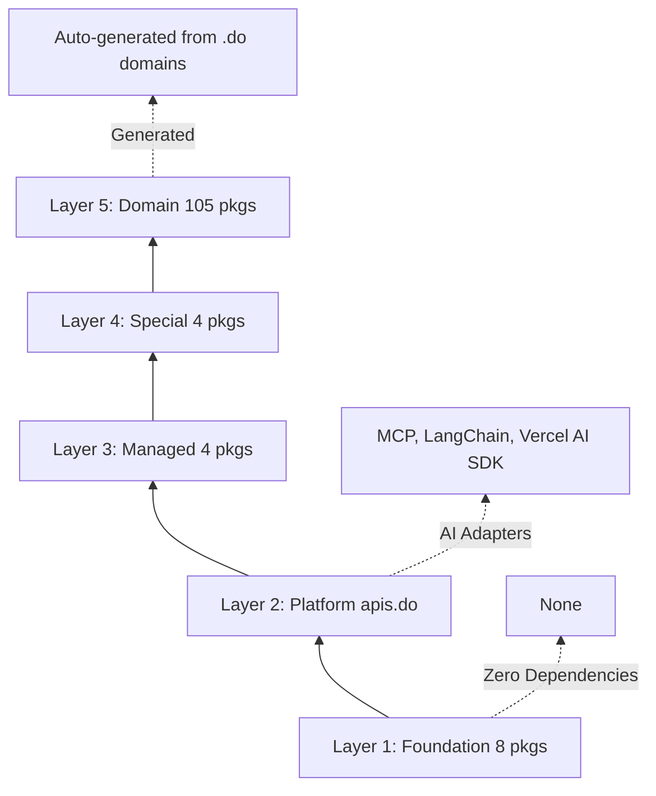
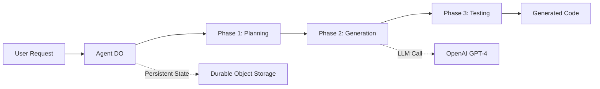
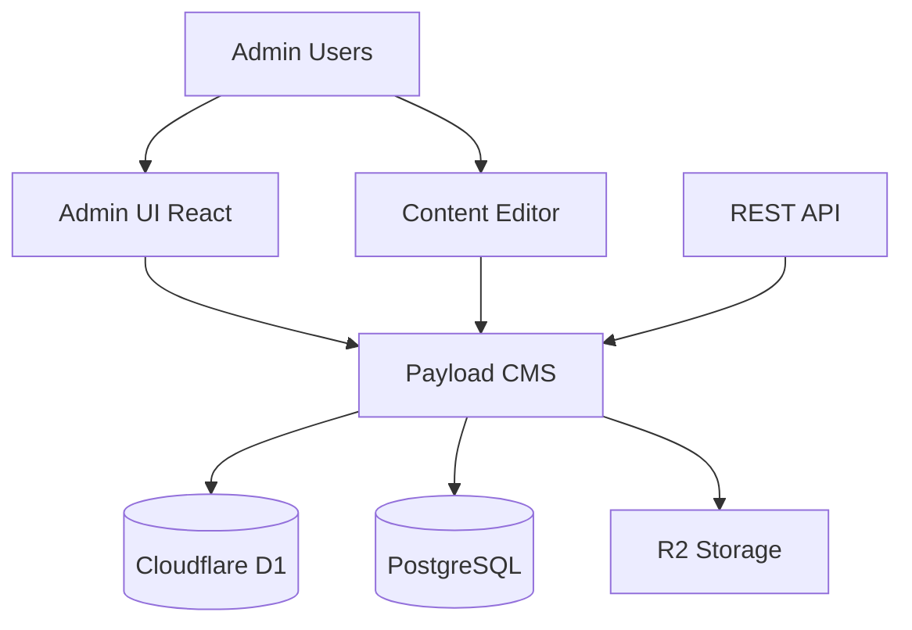

# Architecture Diagrams Library

**Date:** October 3, 2025
**Subagent:** D2 - Repository Enhancement Execution
**Purpose:** Ready-to-paste architecture diagrams for README files

---

## How to Use

Copy the ASCII or Mermaid diagram for the relevant repository and paste into the **Architecture** section of the README.

---

## 1. api.do - Gateway Routing Pattern

### ASCII Diagram

```
                         API Gateway (Hono)
                      ┌───────────────────────┐
                      │  Domain-Based Routing │
                      │  - api.do/*          │
                      │  - functions.do/*    │
                      │  - *.do/*            │
                      └───────────┬───────────┘
                                  │
                     ┌────────────┼────────────┐
                     │            │            │
          ┌──────────▼───┐  ┌────▼─────┐  ┌──▼──────────┐
          │ Authentication│  │ Rate     │  │ CORS        │
          │ Validation   │  │ Limiting │  │ Handling    │
          └──────────┬───┘  └────┬─────┘  └──┬──────────┘
                     └────────────┼───────────┘
                                  │
                        ┌─────────┴──────────┐
                        │  Workers RPC       │
                        │  (Service Bindings)│
                        └─────────┬──────────┘
                                  │
            ┌─────────────────────┼─────────────────────┐
            │                     │                     │
       ┌────▼─────┐         ┌────▼─────┐         ┌────▼─────┐
       │   @db/   │         │  @auth/  │         │   @ai/   │
       │ Database │         │   Auth   │         │  Service │
       │  Service │         │  Service │         │          │
       └──────────┘         └──────────┘         └──────────┘
            │                     │                     │
            │                     ▼                     │
            │              ┌─────────────┐             │
            └─────────────▶│  PostgreSQL │◀────────────┘
                           │    (Neon)   │
                           └─────────────┘
```

### Mermaid Diagram



### Description

**Request Flow:**
1. **Client Request** → API Gateway receives HTTP request
2. **Domain Routing** → Routes based on subdomain (api.do, functions.do, etc.)
3. **Middleware** → Authentication, rate limiting, CORS handling
4. **RPC Dispatch** → Calls appropriate service via Workers RPC
5. **Service Execution** → Service processes request, queries database
6. **Response** → Result bubbles back through stack to client

**Key Components:**
- **API Gateway**: Pure router, no business logic
- **Service Bindings**: Type-safe RPC between workers
- **Database Isolation**: Only @db/ service accesses PostgreSQL
- **Horizontal Scaling**: Each service scales independently

---

## 2. db.do - Database Layer with RPC Access

### ASCII Diagram

```
                    ┌───────────────────────────────┐
                    │      Database Service         │
                    │    (RPC Interface Layer)      │
                    └───────────┬───────────────────┘
                                │
                   ┌────────────┼────────────┐
                   │            │            │
          ┌────────▼───┐  ┌─────▼────┐  ┌──▼─────────┐
          │  Things    │  │Relations │  │   Search   │
          │  CRUD      │  │  CRUD    │  │  Full-Text │
          └────────┬───┘  └─────┬────┘  └──┬─────────┘
                   │            │           │
                   └────────────┼───────────┘
                                │
                   ┌────────────▼────────────┐
                   │  Drizzle ORM (Adapter) │
                   └────────────┬────────────┘
                                │
                   ┌────────────┴────────────┐
                   │                         │
            ┌──────▼────────┐         ┌─────▼────────┐
            │  PostgreSQL   │         │ ClickHouse   │
            │  (Neon)       │         │  (Analytics) │
            │               │         │              │
            │ • Things      │         │ • Events     │
            │ • Relations   │         │ • Metrics    │
            │ • Embeddings  │         │ • Logs       │
            └───────────────┘         └──────────────┘
```

### Mermaid Diagram



### Description

**Database Architecture:**
- **RPC Layer**: Type-safe interface for all database operations
- **Drizzle ORM**: SQL query builder with TypeScript types
- **Dual Storage**: PostgreSQL (primary), ClickHouse (analytics)
- **Vector Search**: pgvector extension for embeddings
- **Connection Pooling**: Neon serverless PostgreSQL

**Key Features:**
- Type-safe queries with Drizzle
- Automatic migrations
- Vector similarity search
- Analytics event tracking
- Query optimization

---

## 3. ai.do - Multi-Provider AI Architecture

### ASCII Diagram

```
                    ┌───────────────────────────────┐
                    │       AI Service (Unified)    │
                    │      Multi-Provider Router    │
                    └───────────┬───────────────────┘
                                │
               ┌────────────────┼────────────────┐
               │                │                │
        ┌──────▼──────┐  ┌──────▼──────┐  ┌────▼──────┐
        │ Text        │  │ Embeddings  │  │  Chat     │
        │ Generation  │  │  Service    │  │  Service  │
        └──────┬──────┘  └──────┬──────┘  └────┬──────┘
               │                │                │
               └────────────────┼────────────────┘
                                │
                   ┌────────────┴────────────┐
                   │  Provider Selection     │
                   │  (Load Balancing)       │
                   └────────────┬────────────┘
                                │
            ┌───────────────────┼───────────────────┐
            │                   │                   │
      ┌─────▼──────┐     ┌──────▼──────┐     ┌────▼────────┐
      │  OpenAI    │     │  Anthropic  │     │  Workers    │
      │  GPT-4     │     │   Claude    │     │     AI      │
      │  GPT-3.5   │     │  Claude-3   │     │  (Llama 2)  │
      └────────────┘     └─────────────┘     └─────────────┘
```

### Mermaid Diagram



### Description

**Multi-Provider Strategy:**
- **Unified Interface**: Single API for all AI providers
- **Provider Selection**: Load balancing, fallback, cost optimization
- **Feature Support**: Text generation, embeddings, chat completions
- **Error Handling**: Automatic retry with alternative providers

**Supported Providers:**
- OpenAI (GPT-4, GPT-3.5, embeddings)
- Anthropic (Claude 3.5, Claude 3)
- Cloudflare Workers AI (Llama 2, BERT embeddings)
- Google (Gemini) - coming soon

---

## 4. workers.do - Microservices Ecosystem

### ASCII Diagram

```
┌─────────────────────────────────────────────────────────────────┐
│                      30+ Microservice Workers                    │
├─────────────────────────────────────────────────────────────────┤
│                                                                  │
│  ┌─────────────┐                                                │
│  │   @api/     │  ◄── Pure Gateway                              │
│  │   Gateway   │      (Routes requests)                         │
│  └─────┬───────┘                                                │
│        │                                                         │
│        │ Workers RPC (Service Bindings)                         │
│        │                                                         │
│        ├─────────┬─────────┬─────────┬─────────┬─────────┐     │
│        │         │         │         │         │         │     │
│        ▼         ▼         ▼         ▼         ▼         ▼     │
│    ┌────────┐ ┌────────┐ ┌────────┐ ┌────────┐ ┌────────┐     │
│    │  @db/  │ │ @auth/ │ │agents/ │ │  ai/   │ │workers/│ ... │
│    │Database│ │  Auth  │ │Service │ │Service │ │30+ more│     │
│    └────────┘ └────────┘ └────────┘ └────────┘ └────────┘     │
│        │         │         │         │         │         │     │
│        └─────────┴─────────┴─────────┴─────────┴─────────┘     │
│                           │                                     │
│                           ▼                                     │
│                    ┌──────────────┐                             │
│                    │  PostgreSQL  │                             │
│                    │  ClickHouse  │                             │
│                    └──────────────┘                             │
│                                                                  │
└─────────────────────────────────────────────────────────────────┘
```

### Mermaid Diagram



### Description

**Microservices Architecture:**
- **Gateway Pattern**: @api/ routes all external requests
- **Service Isolation**: Each service is independent
- **RPC Communication**: Type-safe service bindings
- **Independent Scaling**: Scale services individually
- **Polyglot Support**: Different runtimes per service

**Core Services (8/8):**
- gateway, db, auth, schedule, webhooks, email, mcp, queue

**Domain Services (22+):**
- agents, ai, analytics, billing, cache, cdn, chat, docs, events, files, integrations, notifications, search, seo, storage, sync, tasks, upload, users, vector, websocket, workflows

---

## 5. auth.do - Authentication Flow

### ASCII Diagram

```
                    ┌───────────────────────────────┐
                    │   Authentication Service      │
                    └───────────┬───────────────────┘
                                │
               ┌────────────────┼────────────────┐
               │                │                │
        ┌──────▼──────┐  ┌──────▼──────┐  ┌────▼──────┐
        │   OAuth     │  │  API Keys   │  │ Sessions  │
        │   (WorkOS)  │  │  Management │  │  (JWT)    │
        └──────┬──────┘  └──────┬──────┘  └────┬──────┘
               │                │                │
               └────────────────┼────────────────┘
                                │
                   ┌────────────▼────────────┐
                   │         RBAC            │
                   │  Role-Based Access      │
                   └────────────┬────────────┘
                                │
                   ┌────────────┴────────────┐
                   │                         │
            ┌──────▼────────┐         ┌─────▼────────┐
            │  User Store   │         │  Session     │
            │  (PostgreSQL) │         │  Store (KV)  │
            └───────────────┘         └──────────────┘
```

### Mermaid Diagram



### Description

**Authentication Methods:**
- **OAuth**: WorkOS integration (Google, GitHub, Microsoft)
- **API Keys**: For programmatic access
- **Sessions**: JWT-based session management
- **RBAC**: Role-based permission system

**Security Features:**
- Secure token storage
- Rate limiting
- Brute force protection
- Session invalidation

---

## 6. sdk.do - 5-Layer SDK Architecture

### ASCII Diagram

```
┌─────────────────────────────────────────────────────────────────┐
│                      121 TypeScript SDK Packages                 │
├─────────────────────────────────────────────────────────────────┤
│                                                                  │
│  Layer 5: Domain Packages (105 packages)                        │
│  ┌────────────────────────────────────────────────────────┐    │
│  │  functions.do, agents.do, workflows.do, ... (105 more) │    │
│  └──────────────────────────┬─────────────────────────────┘    │
│                              │                                   │
│  Layer 4: Special Packages (4 packages)                         │
│  ┌──────────────────────────▼─────────────────────────────┐    │
│  │  402.do, do.com.ai, graphdl, others                     │    │
│  └──────────────────────────┬─────────────────────────────┘    │
│                              │                                   │
│  Layer 3: Managed Packages (4 packages)                         │
│  ┌──────────────────────────▼─────────────────────────────┐    │
│  │  llm.do, embeddings.do, models.do, sdk.do              │    │
│  └──────────────────────────┬─────────────────────────────┘    │
│                              │                                   │
│  Layer 2: Platform Package (1 package)                          │
│  ┌──────────────────────────▼─────────────────────────────┐    │
│  │  apis.do (RPC + AI Adapters: MCP, LangChain, Vercel)   │    │
│  └──────────────────────────┬─────────────────────────────┘    │
│                              │                                   │
│  Layer 1: Foundation (8 packages - ZERO dependencies)           │
│  ┌──────────────────────────▼─────────────────────────────┐    │
│  │  do.industries, schema.org.ai, gs1.org.ai, mdx.org.ai, │    │
│  │  ai-generation, ai-embeddings, ai-chat, ai-models      │    │
│  └─────────────────────────────────────────────────────────┘    │
│                                                                  │
└─────────────────────────────────────────────────────────────────┘
```

### Mermaid Diagram



### Description

**5-Layer Dependency Pyramid:**

**Layer 1 (Foundation)**: 8 zero-dependency packages
- Business ontology, Schema.org types, AI types
- No external dependencies
- Pure TypeScript types and utilities

**Layer 2 (Platform)**: 1 package
- apis.do: Universal RPC client + AI tool adapters

**Layer 3 (Managed)**: 4 packages
- High-level managed services (llm.do, embeddings.do, etc.)

**Layer 4 (Special)**: 4 packages
- Special-purpose packages (402.do payment, graphdl GraphQL)

**Layer 5 (Domain)**: 105 packages
- Generated .do domain packages
- Business-specific SDKs

---

## 7. agent.do - AI Code Generation Flow

### ASCII Diagram

```
                    ┌───────────────────────────────┐
                    │   AI Code Generation Agent    │
                    │    (Durable Objects)          │
                    └───────────┬───────────────────┘
                                │
               ┌────────────────┼────────────────┐
               │                │                │
        ┌──────▼──────┐  ┌──────▼──────┐  ┌────▼──────┐
        │  Phase 1    │  │  Phase 2    │  │  Phase 3  │
        │  Planning   │  │  Generation │  │  Testing  │
        └──────┬──────┘  └──────┬──────┘  └────┬──────┘
               │                │                │
               ▼                ▼                ▼
        ┌─────────────┐  ┌─────────────┐  ┌─────────────┐
        │ Prompts     │  │ Code        │  │ Test        │
        │ + Context   │  │ Synthesis   │  │ Execution   │
        └──────┬──────┘  └──────┬──────┘  └──────┬──────┘
               │                │                │
               └────────────────┼────────────────┘
                                │
                   ┌────────────▼────────────┐
                   │  Durable Object State   │
                   │  (Conversation History) │
                   └─────────────────────────┘
```

### Mermaid Diagram



### Description

**Phase-Wise Code Generation:**
1. **Planning**: Analyze requirements, create implementation plan
2. **Generation**: Synthesize code with AI (GPT-4)
3. **Testing**: Generate and run tests, verify correctness
4. **Iteration**: Refine based on test results

**Key Features:**
- Durable Objects for stateful conversations
- Multi-phase generation with checkpoints
- Automatic test generation
- Code quality validation

---

## 8. app.do - CMS Architecture

### ASCII Diagram

```
                    ┌───────────────────────────────┐
                    │   CMS Application (Next.js)   │
                    └───────────┬───────────────────┘
                                │
               ┌────────────────┼────────────────┐
               │                │                │
        ┌──────▼──────┐  ┌──────▼──────┐  ┌────▼──────┐
        │  Admin UI   │  │  Content    │  │  API      │
        │  (React)    │  │  Editor     │  │  (REST)   │
        └──────┬──────┘  └──────┬──────┘  └────┬──────┘
               │                │                │
               └────────────────┼────────────────┘
                                │
                   ┌────────────▼────────────┐
                   │    Payload CMS Core     │
                   └────────────┬────────────┘
                                │
               ┌────────────────┼────────────────┐
               │                │                │
        ┌──────▼──────┐  ┌──────▼──────┐  ┌────▼──────┐
        │  Cloudflare │  │ PostgreSQL  │  │  R2       │
        │  D1 (SQLite)│  │  (Neon)     │  │  (Files)  │
        └─────────────┘  └─────────────┘  └───────────┘
```

### Mermaid Diagram



### Description

**CMS Architecture:**
- **Frontend**: Next.js with React admin UI
- **Backend**: Payload CMS headless API
- **Database**: Cloudflare D1 (SQLite) + PostgreSQL
- **Storage**: Cloudflare R2 for media files

**Features:**
- Content editing UI
- Role-based access control
- Media management
- API generation
- Deploy to Cloudflare Pages

---

**End of Architecture Diagrams Library**

**Usage:**
1. Choose diagram for relevant repository
2. Copy ASCII or Mermaid code
3. Paste into README.md Architecture section
4. Customize if needed
