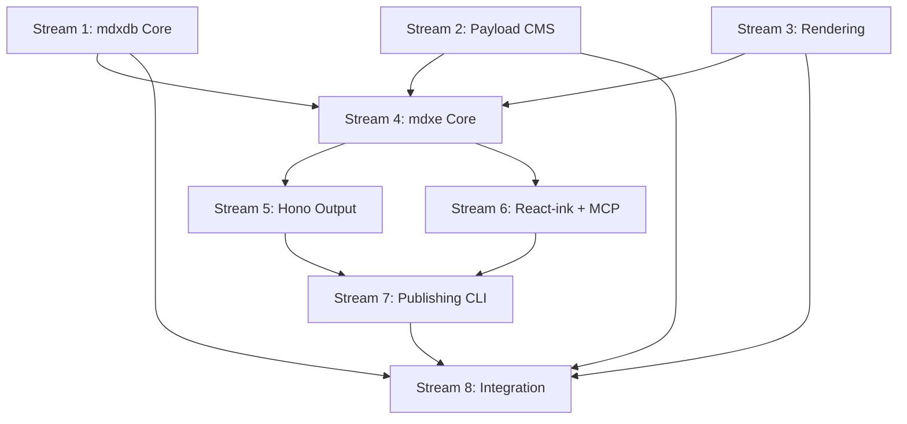

# mdxdb & mdxe Implementation Plan

**Issue:** https://github.com/dot-do/.do/issues/5
**Date:** 2025-10-03

## Executive Summary

Complete simplification and modernization of `mdxdb` and `mdxe` packages to leverage Cloudflare's new Worker Loader capabilities, enabling secure real-time MDX evaluation and multi-format output.

## Research Findings

### Existing Architecture

**mdxdb (packages/mdxdb/):**
- ✅ Core types and interfaces established
- ✅ File system implementation with Velite
- ✅ SQLite implementation with embeddings
- ✅ Schema discovery from `.db` folder
- ✅ Collection-based access pattern
- ✅ Functions: build, watch, set, list, get, delete

**mdxe (packages/mdxe/):**
- ✅ CLI with commands: dev, build, start, test, lint, exec
- ✅ Next.js template with Payload CMS
- ✅ React-ink for CLI UI
- ✅ MDX execution engine
- ✅ Function extraction and execution
- ✅ Test runner integration

### Cloudflare Game Changers

**Worker Loader (Beta):**
- Runtime loading of Workers in isolates
- Millisecond spin-up times
- Secure sandboxing for untrusted code
- **Unlocks:** Real-time MDX/JS/TS evaluation on Workers

**Payload CMS on Workers:**
- D1 adapter (SQLite-based)
- R2 storage integration
- Serverless deployment
- Global distribution

## mdxdb Architecture (Simplified)

### Core Capabilities

1. **YAML Schema Definition**
   - Based on Payload CMS field types
   - Simple, declarative configuration
   - Auto-generate collections from schema

2. **Velite Wrapper**
   - Optional schema enforcement
   - Build-time validation
   - Zero-config defaults

3. **Database Functions**
   ```typescript
   db.list(pattern?: string) // Glob-based listing
   db.get(id: string) // Single document
   db.set(id: string, content: any) // Update/create
   db.delete(pattern: string) // Glob-based deletion
   ```

4. **Payload CMS Integration**
   - Barebones Workers implementation
   - Port D1 adapter to SQLite (Drizzle differences)
   - Minimal admin UI
   - File system or Payload context switching

5. **Website Rendering**
   - Custom styling based on tweakcn (YAML config)
   - Markdown/MDX rendering
   - Minimal, fast output

### Implementation Structure

```
packages/mdxdb/
├── core/               # Base types and utilities
│   ├── types.ts       # TypeScript interfaces
│   ├── schema.ts      # YAML schema parser
│   └── db.ts          # Core DB implementation
├── velite/            # Velite wrapper
│   ├── index.ts       # Velite integration
│   ├── config.ts      # Auto-generated configs
│   └── validate.ts    # Schema validation
├── payload/           # Payload CMS integration
│   ├── adapter.ts     # D1/SQLite adapter (Drizzle)
│   ├── config.ts      # Payload config generator
│   └── collections.ts # Auto-generated collections
└── render/            # Website rendering
    ├── tweakcn.ts     # YAML styling parser
    ├── mdx.ts         # MDX rendering
    └── templates/     # Default templates
```

### Key Files to Modify/Create

1. **`packages/mdxdb/core/schema.ts`** - YAML schema parser
2. **`packages/mdxdb/payload/adapter.ts`** - D1 adapter port
3. **`packages/mdxdb/render/tweakcn.ts`** - YAML styling
4. **`packages/mdxdb/velite/validate.ts`** - Schema enforcement

## mdxe Architecture (Simplified)

### Core Capabilities

1. **Embedded mdxdb**
   - Full database access
   - Schema-aware rendering
   - Collection-based routing

2. **Four Output Formats**

   **A. Hono Output**
   - Mode 1: Pure markdown output
   - Mode 2: HTML with Tailwind typography
   - Minimal middleware
   - Worker-ready

   **B. React-ink Output**
   - CLI rendering
   - AI agent consumption
   - Stream-friendly
   - ANSI color support

   **C. MCP Output**
   - Model Context Protocol
   - Tool definitions
   - Resource bindings
   - Agent integration

   **D. Worker Loader Integration**
   - Real-time MDX evaluation
   - Secure sandboxing
   - Dynamic imports
   - Type-safe execution

3. **CLI Publishing**
   - Deploy to Workers
   - Deploy as Cloudflare Snippets
   - Publish to Worker Assets
   - Zero-config deployment

### Implementation Structure

```
packages/mdxe/
├── src/
│   ├── core/
│   │   ├── db.ts          # mdxdb integration
│   │   ├── loader.ts      # Worker Loader wrapper
│   │   └── eval.ts        # Safe MDX evaluation
│   ├── outputs/
│   │   ├── hono/
│   │   │   ├── markdown.ts    # Pure markdown
│   │   │   └── html.ts        # HTML + Tailwind
│   │   ├── react-ink/
│   │   │   ├── renderer.ts    # CLI rendering
│   │   │   └── components.ts  # Ink components
│   │   ├── mcp/
│   │   │   ├── protocol.ts    # MCP implementation
│   │   │   ├── tools.ts       # Tool definitions
│   │   │   └── resources.ts   # Resource bindings
│   │   └── shared/
│   │       └── mdx-utils.ts   # Common utilities
│   ├── cli/
│   │   ├── commands/
│   │   │   ├── publish.ts     # Publish to Workers
│   │   │   ├── snippet.ts     # Create Snippet
│   │   │   └── assets.ts      # Upload to Assets
│   │   └── index.ts
│   └── template/              # Project templates
└── tests/                     # Test suites
```

### Key Files to Modify/Create

1. **`packages/mdxe/src/core/loader.ts`** - Worker Loader integration
2. **`packages/mdxe/src/outputs/hono/`** - Hono output modes
3. **`packages/mdxe/src/outputs/mcp/`** - MCP protocol
4. **`packages/mdxe/src/cli/commands/publish.ts`** - Deployment

## Parallel Work Streams

### Stream 1: mdxdb Core (Agent 1)
**Duration:** 3-4 hours
**Tasks:**
1. Create YAML schema parser (`core/schema.ts`)
2. Implement schema validation
3. Update db functions for glob support
4. Add schema enforcement to Velite wrapper

**Deliverables:**
- `packages/mdxdb/core/schema.ts`
- `packages/mdxdb/velite/validate.ts`
- Updated `packages/mdxdb/core/db.ts`
- Tests for schema parsing

### Stream 2: Payload CMS Integration (Agent 2)
**Duration:** 4-5 hours
**Tasks:**
1. Port D1 adapter to SQLite (Drizzle)
2. Create barebones Payload config generator
3. Implement context switching (fs vs payload)
4. Add minimal admin UI

**Deliverables:**
- `packages/mdxdb/payload/adapter.ts`
- `packages/mdxdb/payload/config.ts`
- `packages/mdxdb/payload/collections.ts`
- D1 vs SQLite migration guide

### Stream 3: Website Rendering (Agent 3)
**Duration:** 2-3 hours
**Tasks:**
1. Create tweakcn YAML parser
2. Implement MDX rendering with custom styles
3. Create default templates
4. Add Tailwind integration

**Deliverables:**
- `packages/mdxdb/render/tweakcn.ts`
- `packages/mdxdb/render/mdx.ts`
- `packages/mdxdb/render/templates/`
- Style examples in YAML

### Stream 4: mdxe Core + Worker Loader (Agent 4)
**Duration:** 4-5 hours
**Tasks:**
1. Integrate mdxdb into mdxe
2. Implement Worker Loader wrapper
3. Create safe MDX evaluation engine
4. Add dynamic import support

**Deliverables:**
- `packages/mdxe/src/core/db.ts`
- `packages/mdxe/src/core/loader.ts`
- `packages/mdxe/src/core/eval.ts`
- Worker Loader examples

### Stream 5: Hono Output Format (Agent 5)
**Duration:** 2-3 hours
**Tasks:**
1. Implement markdown output mode
2. Implement HTML + Tailwind mode
3. Add routing and middleware
4. Create Worker deployment config

**Deliverables:**
- `packages/mdxe/src/outputs/hono/markdown.ts`
- `packages/mdxe/src/outputs/hono/html.ts`
- Example Hono app
- Tests for both modes

### Stream 6: React-ink + MCP Outputs (Agent 6)
**Duration:** 3-4 hours
**Tasks:**
1. Create React-ink renderer
2. Implement MCP protocol
3. Add tool definitions
4. Create resource bindings

**Deliverables:**
- `packages/mdxe/src/outputs/react-ink/`
- `packages/mdxe/src/outputs/mcp/`
- CLI examples
- MCP server implementation

### Stream 7: Publishing CLI (Agent 7)
**Duration:** 2-3 hours
**Tasks:**
1. Implement `mdxe publish` command
2. Add Cloudflare Snippets support
3. Add Worker Assets upload
4. Create deployment templates

**Deliverables:**
- `packages/mdxe/src/cli/commands/publish.ts`
- `packages/mdxe/src/cli/commands/snippet.ts`
- `packages/mdxe/src/cli/commands/assets.ts`
- Deployment documentation

### Stream 8: Integration & Documentation (Agent 8)
**Duration:** 2-3 hours
**Tasks:**
1. Integration testing across all streams
2. Update README files
3. Create usage examples
4. Write migration guide

**Deliverables:**
- Integration tests
- Updated documentation
- Example projects
- Migration guide from old versions

## Dependencies



## Success Criteria

### mdxdb
- ✅ YAML schema parsing and validation
- ✅ Velite wrapper with schema enforcement
- ✅ Glob-based list/delete functions
- ✅ Payload CMS on Workers (barebones)
- ✅ D1/SQLite adapter (Drizzle-based)
- ✅ Website rendering with tweakcn

### mdxe
- ✅ mdxdb embedded and functional
- ✅ Worker Loader integration
- ✅ Hono output (markdown + HTML)
- ✅ React-ink output
- ✅ MCP protocol implementation
- ✅ Publishing CLI (Workers + Snippets + Assets)
- ✅ Zero-config deployment

## Timeline

**Total Duration:** 3-5 hours (with 8 parallel agents)

**Phase 1 (Parallel):** Streams 1-3 (mdxdb foundation)
**Phase 2 (Parallel):** Streams 4-6 (mdxe outputs)
**Phase 3 (Sequential):** Streams 7-8 (publishing + integration)

## Next Steps

1. ✅ Create this implementation plan
2. ⏳ Dispatch 8 parallel subagents
3. ⏳ Monitor progress and dependencies
4. ⏳ Run integration tests
5. ⏳ Update root documentation
6. ⏳ Close issue #5

## Notes

- All agents should follow existing code style
- Use TypeScript strict mode
- Aim for 80%+ test coverage
- Document all public APIs
- Follow monorepo patterns (workspace:*)
